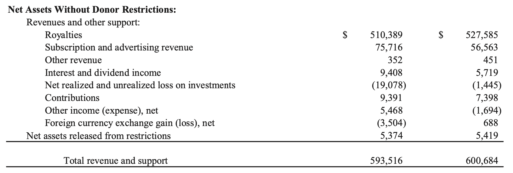
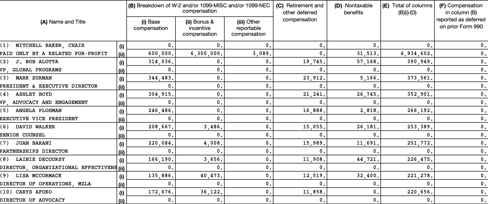
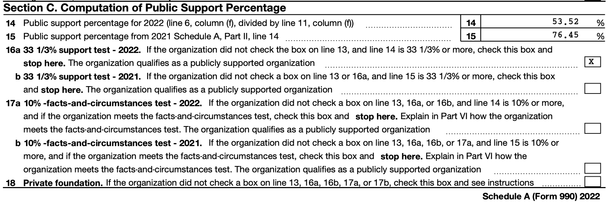

I have a problem with Mozilla, and there's enough here to warrant a whole post. Credits to [Bryan Lunduke](https://lunduke.locals.com/post/4387539/firefox-money-investigating-the-bizarre-finances-of-mozilla) for the idea, and you can consider this an updated version of his post. Update: He also has a [2023 version](https://lunduke.locals.com/post/5053290/mozilla-2023-annual-report-ceo-pay-skyrockets-while-firefox-marketshare-nosedives)!

## My Problem with Mozilla

I don't think Firefox is sustainable under Mozilla. They make a lot of questionable decisions with regards to the development of Firefox, how as well as how they claim to be run solely on donations when they're obviously not, and their attitude towards their other projects.

There's been a sentiment recently that the Mozilla are simply [ignoring the community](https://www.reddit.com/r/firefox/comments/gwquaj/firefox_devs_blatantly_ignoring_what_the/), especially with big changes like the Photon UI update. Their CEO also seems to be [gaining salary increments](https://en.wikipedia.org/wiki/Mitchell_Baker#Negative_salary-achievements_correlation_controversy) while they keep [laying off](https://www.theverge.com/2020/8/11/21363424/mozilla-layoffs-quarter-staff-250-people-new-revenue-focus) their employees.

## Finances

They also seem to delve into politics more often than I'm really comfortable with, and despite receiving [$400-450 million](https://uk.pcmag.com/suites/128195/mozilla-signs-lucrative-3-year-google-search-deal-for-firefox) from Google every year, they make it seem like they're the little guy that runs solely off of donations. According to their [auditor's report for 2022](https://assets.mozilla.net/annualreport/2022/mozilla-fdn-2022-fs-final-0908.pdf), they have $1.3 billion in assets, with about $513 million in cash alone. However, their total expenses are only $425 million, with only $220 million being allocated to "Software development". For a company focused on browser development, that's not a lot that's being allocated towards it.

As for where they even got this money, they received more than $500 million from "Royalties",

which are:

::: quote Mozilla Foundation and subsidiaries, Independent Auditor's Report {href="https://assets.mozilla.net/annualreport/2022/mozilla-fdn-2022-fs-final-0908.pdf"}
Mozilla provides the Firefox web browser, which is a free and open-source web browser initially developed by Mozilla Foundation and the Corporation. Mozilla incorporates search engines of its customers as a default status or an optional status available in the Firefox web browser. Mozilla generally receives royalties at a certain percentage of revenues earned by its customers through their search engines incorporated in the Firefox web browser.
:::

So basically, search engine deals. Other than that, we have the "Subscription and advertising revenue" clocking in at $75 million dollars. These are described as:

::: quote Mozilla Foundation and subsidiaries, Independent Auditor's Report {href="https://assets.mozilla.net/annualreport/2022/mozilla-fdn-2022-fs-final-0908.pdf"}
Mozilla's subscription revenues primarily consist of revenue from subscriptions to a service known as Pocket Premium and VPN.

[...]

Mozilla also offers advertising services in three formats. The first is the New Tab / Tiles advertising service, which places links to sponsored content when a new tab is opened in the Firefox web browser. The second format is through Pocket's email product, Pocket Hits. Pocket Hits may include paid advertisements, which are places in email newsletters that get delivered to global Pocket users. Lastly, Mozilla also sells web advertisement spots on content that Mozilla licenses and syndicates from publisher partners across the web.
:::

### Services

Let's talk a little bit about Mozilla VPN. It's built completely on top of Mullvad VPN, according to their [terms of service](https://www.mozilla.org/en-US/about/legal/terms/subscription-services/). However, they charge anywhere between [$10 per month or $60 per year](https://www.mozilla.org/en-US/products/vpn/?entrypoint_experiment=vpn-pricing-position&entrypoint_variation=2) for their service, while also requiring you to make a Mozilla account with your email. In comparison, Mullvad's pricing is [€5 per month](https://mullvad.net/en/pricing) regardless of how long you subscribe, have many more payment options (even cash!), and don't collect any personal information in their registration process.

I don't use Mullvad or Mozilla VPN, but it's pretty clear to me which one's the better option.

As for Pocket, here's a little snippet from their privacy policy:

::: quote Pocket Privacy Policy {href="https://getpocket.com/en/privacy/#sharing"}
We also share aggregated, non-personal data and related usage information, which does not contain any personal information which can identify you or any other individual user, with third parties, including content providers, website operators, advertisers and publishers. For example, we may share with a content provider a list of the most saved articles to Pocket based on an analysis of aggregated, anonymous user data, but we would not share with such content provider any personal information regarding such users.
:::

It's a better privacy policy than most services, I will admit, but it's still not something I'd expect from a privacy-first non-profit organisation.

Speaking of which, let's see how much they made from donations: less than $10 million. That's very interesting for an organisation that ["rely on donations to carry out our mission"](https://donate.mozilla.org/). Donations alone wouldn't even be able to fund a tenth of their software development, let alone all of the other things Mozilla does.

Okay, so where does the money go? Let's have a look at their 2022 Form 990, which is a US IRS form that provides information about a non-profit organisation to the public. This includes how much some of their executives made, which looks something like this:

The CEO, Mitchell Baker made nearly $7 million! Effectively 70% of the donations went in the CEO's pockets alone, and adding up the rest of the executives comes out to around $9.5 million. And before someone complains that Mitchell Baker was paid by a "related for-profit", I'd like to mention that the non-profit Mozilla Foundation actually owns two for-profit corporations: Mozilla Corporation and MZLA Technologies Corporation. It's pretty likely that she was paid by one of these.

At first I thought it was really funny that they'd selected "An organization that normally receives a substantial part of its support from ... the general public" for "Reason for Public Charity Status". But then I thought to myself, there's no way that they make that big of a part from donations. I looked further down and saw that they said that they'd made $9,075,862 from "Gifts, grants, contributions, and membership fees received". However, their "Gross income from interest, dividends, payments received on securities loans, rents, royalties, and income from similar sources" ended up being $20,900,277.

I'm not a finance or accounting person, but seeing as their audit report says they made $9.4 million from "contributions", the $9.07 million figure doesn't make sense to me. What makes even less sense is that their "royalties" are $510 million in their audit report, but only $20 million in their Form 990. This means that, assuming the Form 990 and the audit report are categorising things the same way, Mozilla only made around 4% of their money from what they seem to define as "contributions".

That means they wouldn't meet any of the public support tests needed to qualify as a "publically supported organisation", and would be a private foundation.

Is there something illegal going on here? Probably not. Like I said, I'm no money or law person, and there's a good chance I'm overlooking something or misunderstanding it. However, the numbers just don't add up and I'm a little suspicious.

## Politics

Here's a small list of political organisations that Mozilla invested in:

- [Fair Trials](https://www.fairtrials.org) - $15000
- [Whose Knowledge?](https://whoseknowledge.org/) - I can see why Mozilla would invest in them, but it's a political organisation and so I'm adding it here. - $50000
- [Women's March Network](https://www.womensmarch.com) - $50000

And some others I couldn't find anything about

- Good Mirrors Aren't Cheap, LLC
- Start Somewhere, LLC

Now, I'm not against people fighting for what they believe in (even if I don't necessarily agree with them), and if anyone from Mozilla wants to invest their own money to further those causes, then I'm all the happier for them. However, I don't see why that has to go through a tech company's accounts. Most of the organisations that "Mozilla" seems to invest in generally align with its CEO's views. On the other hand, they've been known to lay off their own employees that were working on innovative projects like the [Rust programming language](https://blog.rust-lang.org/2020/08/18/laying-the-foundation-for-rusts-future.html) or the Servo team.

::: quote Mozilla lays off 250 employees while it refocuses on commercial products, Catalin Cimpanu, ZDNet, 2020 {href="https://www.zdnet.com/article/mozilla-lays-off-250-employees-while-it-refocuses-on-commercial-products/"}
Main casualties of today's layoffs were the developers working on the company's experimental Servo browser engine and Mozilla's threat management security team.
:::

## Conclusion

There's a lot more to the story, and Mozilla keeps doing things that make me distrust them. I like Firefox, and I get its importance in the web ecosystem. Resources like MDN have been incredible in my web development journey. But when Mozilla does things like [laying off the entire MDN writers team](https://twitter.com/i/web/status/1293264395603148802), and there's a [general concern about Firefox's future](https://www.wired.com/story/firefox-mozilla-2022/), it's a little hard for me to have faith in them.

Also a few things I want to note:

- Yes, I'm aware that other browsers exist and I should simply use those instead. That's not the point of this post. The point is to highlight my issues with Mozilla as a company, and their handling of Firefox. Mozilla can, and should, do better.
- I know a lot of the arguments I make here can be applied to basically every other company. But I don't think Mozilla should be like every other company, especially considering how they advertise themselves as a non-profit while acting like every for-profit. Just because Google, Microsoft or Facebook act a certain way, doesn't mean Mozilla should follow.
- Before someone responds with "We need Firefox so that Google doesn't have a monopoly", it's a tad bit late for that. Chromium is already effectively a monopoly (and also open source, by the way), and WebKit (also open source) is next up on that list. Firefox stands at about 3% market share, which I don't think is nearly enough to be considered competition. And with the EU forcing Apple to allow other browser engines on iOS, I imagine the Chromium market share is only going to increase from here.

Anyway, thanks for coming to my TED talk. That's all folks!
