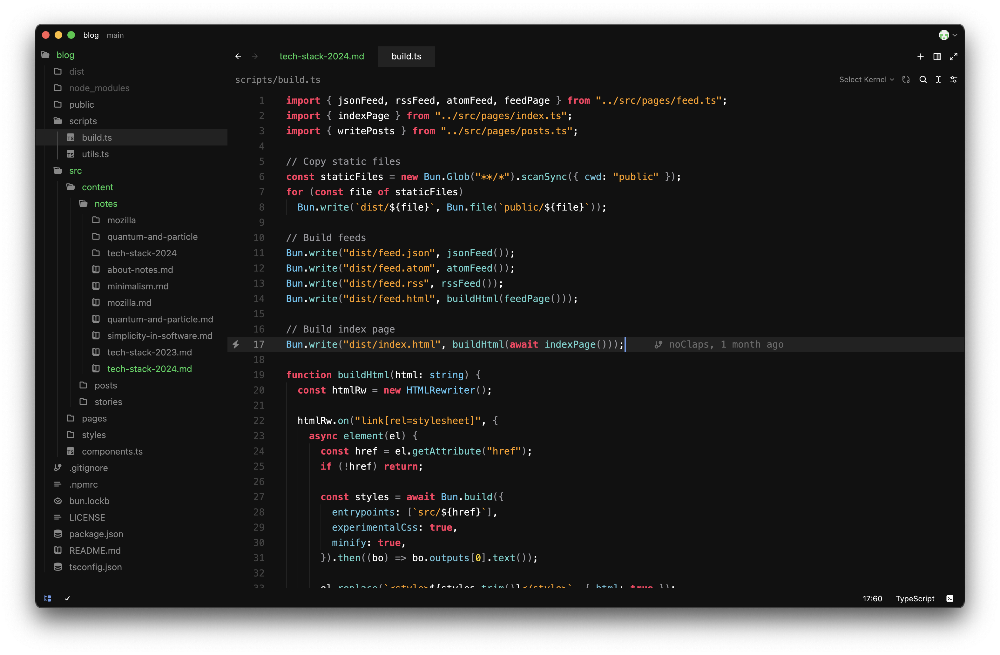

[Last year's Textack](./tech-stack-2023)

Well, it's been a year since I last shared my tech stack, so let me show you what's changed over the last year, and some of my plans for 2025.

## Hardware

I'm still rocking the MacBook Air M2, and I've discovered a few weird quirks of macOS that I'm not so fond of, but on the whole it's still been a far, far better experience than Windows and Linux were. Unless Linux makes some huge strides, I'm most likely going to be sticking with Mac for the forseeable future.

As for my phone, it's still the same one as before, the Google Pixel 6a, which I realise that I never actually mentioned that in the previous post. It's held up really well, and I'm genuinely surprised at how good the battery life is, given that it's over 2 years old now. I've had times where it's lasted like a whole 24 hours, though to be fair I wasn't using it a whole lot in that time, since I do most of my work on the laptop. Still, quite happy with it.

I also have a pair of Sony WH1000XM4 headphones that I've been using for about 4 years now, give or take. They still sound amazing, though I feel like the noise cancelling might be getting worse over time. The pads are also deteriorating, and I'm probably gonna end up buying a new pair in a couple years. I'm pretty happy with these for the time being, though.

## Software

I've switched over to Affinity Photo from Luminar AI, though that's only for the 6 month free trial. I don't think I'm going to buy it, it does way more than I will ever need for editing photos, especially given that I want to _decrease_ the amount I edit them by, and keep them as natural-looking as possible. However, that's not a guarantee, and I've been eyeing both Affinity Photo and Photomator as potential replacements for Luminar since it's pretty much EOL. Photomator is particularly interesting to me since [Apple bought the company recently](https://www.pixelmator.com/blog/2024/11/01/a-new-home-for-pixelmator.html), and I'm curious what they do with it. Guess we'll see in next year's Textack.

As for my editor, that's gone through a whole bunch of changes. Soon after I wrote the last Textack, I switched to Vim. It worked for a while, but it would crash on large files and the syntax highlighting wasn't always great either, so I ended up switching to Neovim sometime in early January. That was a lot of fun to do, though configuration wasn't always the best. After a couple months of Neovim, I finally ended up on Zed, where I still am now. It gives me a lot of the performance that Neovim did, and I get to use the shortcuts and keybinds that I'm used to. I've even made my own custom editor theme for it, here's what it looks like:

It's a great editor so far, and there's extensions for pretty much all the languages I use regularly, though not all of them work as seamlessly as they did in VSCode. In particular, the extensions for Astro and Swift cause me issues sometimes, but it's still a good enough experience that I'm not too upset by it, and I find it difficult to use any other editor for now. Maybe someday I'll find an editor I like more than Zed, but for now I'm sticking with it.

Another thing I didn't talk about last year was my browser. I use Safari for pretty much everything on my Mac. I've tried other browsers, but so far I've always come back to Safari. It's really fast, very power efficient, and fairly minimal. It gets out of my way and lets me just browse. The web dev experience is a bit lacking though, since Safari sometimes tends to get web features slower than other browsers do, but I've seen a recent ramp up in new features, so good on the WebKit team for pushing them out as quickly as they are!

### Languages

The only times I do Python now are for assignments. It's just too annoying for me to use, and so I end up using other languages instead. I tried using Julia for a bit to replace Python, but didn't go very far with that.

I still do use TypeScript, but that's mostly just for web projects now, which I suppose has been most of my projects over the last year. I did start doing more Swift earlier this year, and I hopped between Go, Swift and Rust for my different CLI projects, before finally settling on C for the ones that can run locally, like `random`, and Go for the ones that need an HTTP client, like `lsdeps`. I'm still in the process of transitioning some of my Swift projects to C, and I feel like I have a much better understand of all 3 languages now than I did at the beginning of the year. I still don't get Rust though, maybe I'll give it more of a try next year.

I also had a little stint with Zig, though it was just too low level for me. I'd love to explore it more as the language develops and stabilises, but I don't want to jump into a pre-1.0 language just yet. I'm planning to stick with C and Go for now, and see how far I can get with those.

### CLI development tools

I'm adding a new section to this, because I've developed a love for CLI tools recently. There's something really nice about having a tool that runs locally, instantly and (depending on the tool) without an internet connection. Plus, I've learned a lot about how they work internally by making them in C, and it's been so much fun. I'm going to continue making CLI tools, so hopefully I'll have something more interesting to say by next year.

I use the Clang that came with XCode Command Line Tools to compile C code, and the official Go compiler for Go code. I don't use any optimisation flags, because I've noticed that they seem to sometimes break my code, and it's just something I don't really want to worry about, especially since the programs themselves run fairly quickly without them anyway. For example, `random` takes about 6ms to run without any flags!

### Web development tools

Funny enough, soon after I wrote last year's post, I moved off of the monorepo for my personal websites and into separate repos again. It was just easier for me to work with and deploy them separately, and soon after I redesigned them to look unique. The [homepage](https://zerolimits.dev) now looks like a terminal, the gallery looks a lot cleaner, and you're looking at the blog right now.

I am still using Bun, and I've removed Node from my system entirely. Sometimes things break and I have to reinstall it, but that's usually external tools like Wrangler, and I end up uninstalling it the moment I'm done anyway.

I don't use SCSS anymore, I've since switched over to [LightningCSS](https://lightningcss.dev) for the cases where I need compatibility since it's really fast, and can build my CSS with fallbacks for browsers that may not support the features I'm using. For other projects where I don't care about compatibility as much, I just use CSS that works in my browser and hope it works elsewhere until someone tells me otherwise.

I don't use a whole lot of Astro or HTMX or any other framework anymore, either. Instead, I've ended up just using Bun directly, and all their helper functions for starting a web server and building TypeScript into JavaScript. I find that it gives me a lot more control over how my code is structured, and allows me to do things a framework probably wouldn't, like putting all the CSS for a page in the `<head>` instead of serving it as a separate file.

I've also written my own markup language, called [Znak](https://gitlab.com/noClaps/znak-lang), which I'm using to write this blog right now! It's syntactically very similar to Markdown, but the compiler has features like LaTeX support and syntax highlighting built-in. It was very fun to make, and I'm probably going to continue to use it for any future projects that I might've instead used Markdown for. You can try out a live demo of it [here](https://znak.zerolimits.dev).

I do still use Astro for larger projects, where just trying to use `Bun.serve` would make things way too difficult and I just can't be bothered to figure that out. I don't like seeing hundreds of dependencies getting installed onto my computer, but it's still better than the alternative of having to write all that code myself. Astro's still a very nice experience to use, and it gets better with every update.

## The future

I've already mentioned a few things I wanted to do in 2025, but I'll collect them here and add some more.

- I want to get back into photo editing. I have a ton of photos from over the years just sitting around, and even though most of them probably won't make it to the gallery, there's bound to be some good ones in there I can edit. Luminar AI is EOL now, and so if I can find an alternative that's not too expensive, and keeps getting updates, I'd be happy to switch over. Keeping an eye on Affinity Photo and Photomator for now.
- I want to try out other languages, like Gleam, and give some languages another go, like Rust and Zig. I'm not sure what projects they'd be good for that my existing set of languages can't already do pretty well, but it's worth a try to find out, I suppose.
- I want to stop using TypeScript for a lot of the things I use it for now, and maybe switch them over to Go. I also want to figure out how to use WASM for some of my projects, like Znak, so that I can use them on the web, but still work in native languages. I did try using Go and Rust for it, but Go's WASM didn't seem to work with Bun, and I didn't quite understand how to use Rust properly. I'm not 100% on this, and I might just keep the distinction of TypeScript for web projects and Go/C/[native language] for everything else.

Here's some updates from last year's future list:

- I'm still interested in learning more low-level concepts, but maybe not in the sense of just theoretical knowledge, but more of how I can actually build things that take advantage of those ideas. I feel like knowing and working with C is probably a good enough stopping point, I don't really plan on dropping down into Assembly anytime soon.
- I don't really want to get into app development anymore. Though Swift does feel nice to use, app dev would mean I'm either locked into whatever platform I'm building apps for, or I'm using web technologies to make apps, using Electron or Tauri. At that point, I'd rather just make a website or a CLI tool, whichever is more appropriate for the job, and not worry about permission systems or native APIs or porting apps from one platform to another.
- I did try to make my own documentation site generator, like [VitePress](https://vitepress.dev), called ZnakPress, but I didn't get very far and I gave up. I might get back to that at some point next year, because I do want to complete that project, but as for making a full static site generator like Astro or Hugo, I don't really have any plans to do that anymore. I suppose making build scripts that generate the HTML for me is probably close enough.
- I did enjoy designing things, but I don't think that's what I really want to do. I've made new designs for most of my websites, and a whole code theme for Zed, but it's a lot more fun to just code than it is to think about designing UIs, though I still do it if I need/want to. I like pretty-looking UIs, and it's nice to think artistically sometimes.

## Conclusion

It's been quite a year for me. I didn't feel like I'd accomplished a whole lot this year, but making this post, I can see that I've done quite a bit! I really enjoyed working in all the different languages that I did, and I've learned a lot from them!

Anyway, that's all for 2024, folks! Happy holidays, and I'll seeya next year!
