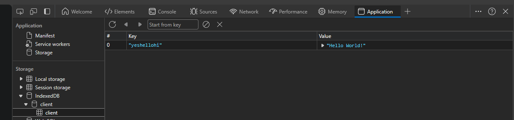
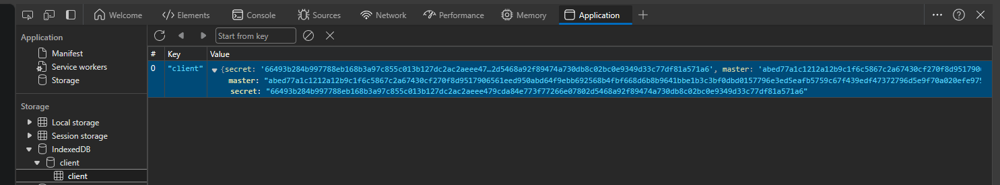

## The challenge

In both the X3DH and Double Ratchet algorithms, we use a lot of private keys and states that must be kept a secret from the world. Unfortunately, this raises a problem: how are we going to store them, we can't just keep a browser open, or a device turned on forever!

This appendix is all about this challenge: we'll compare storing keys on server and device, learn about `SubtleCrypto`'s built-in functionality for encrypting `CryptoKey` objects and finally write a class that can store and read a private secret value securely.

## Server or device?

One of the most important question you have to ask when designing a system like this is where the keys are going to be stored? There are two options: either store them on the server or on the device. Both options have valid pros and cons, so let's take a look at them.

### Security

The most important aspect of this question is security. By storing the keys on device, you're drastically reducing the attack surface of your system. However, it's still recommended to use encryption on the device, and if you do that already, why not just use the server, right? The thing is, even if you trust the server to keep your encrypted keys safe, you have no guarantee that the server itself won't want to get access to your encrypted data and start trying to break it. For some people, this might be a valid concern. Sure, it sounds like a conspiracy theory, but that's what threat modelling is all about: thinking about the worst case scenario and preparing for it.

### Simplicity

We also have to think about how seamless and simple the system is to use. Think about a user trying to log in to their account on a new device. If the keys are stored on the server, all they have to do is enter their password and they're good to go. If the keys are stored on device, they have to go through a whole process of exporting and importing keys, which is not only more complicated, but also more error prone. You can design the system to be more seamless and transparent to the user, but that would require a lot of work, and even then, it would still be more complicated than the server-based solution.

### Privacy

Privacy is also a big deal. Storing keys on device improves privacy by giving more control over the keys to the user. However, it also means that the user is responsible for keeping their keys safe. If they lose their device, they lose their keys, and with that, all their conversations. If the keys are stored on the server, the user doesn't have to worry about this, but they also have to trust the server, which we've discussed is not always a good idea.

### Conclusion

As you can see, both options have their pros and cons, and there's no clear winner. It's up to you to decide which one you want to use. In this tutorial, we'll be using a device-based solution, but you can easily adapt it to a server-based one.

## Where's the encryption key?

Now that we've decided where to store private data, we also need to figure out *how* to encrypt it. A simple solution would be to use the user's password as the encryption key for private data, but then changing the password will be very complicated - think about how much data would need to be re-encrypted. A much clearner solution would be a "master key", which will be responsible for encrypting all the other data. This way, when we change the password, we only have to re-encrypt a single key.

```
Password --encrypts--> Master key --encrypts--> Private data
```

### Securing the password

Using a master key as a middle man is a great idea, but there's still a problem: if we encrypt the master key using the password, but then log in to the server using the same password, it's the same as if we just stored the private data unencrypted. We need to make sure that the server doesn't learn the necessary information required to decrypt the master key. The solution is rather simple: don't use the password itself to authenticate.

### From password to authentication key

In the Double Ratchet Algorithm, we've used HKDF extensively. We can also use it to derive an authentication key from the password. This way, the server will not learn the password, but we can generate the same authentication key and use that to authenticate.

It's also time we play around with the HKDF's info parameter. Previously we've only used constant strings, but now we'll use it to influence the HKDF output. The input will be our password, and the info parameter is going to be used to generate either the authentication key or the encryption key for the master key.

But what about the salt? Previously, we've just used an empty `Uint8Array`, because the input was always 32 bytes of random data with a high enough entropy. However, passwords are not random, and it can happen that multiple people share the same password. This means that if we use an empty salt, the output of the HKDF will be the same for all users with the same password. This is not good, since an attacker could use a so called "rainbow table" which has precomputed values of all the possible outputs of the HKDF, and use that to quickly find the password of a user and break encryption. To prevent this, we need to use a random salt. This salt will be stored on the device alongside the encrypted data, and will be used to randomise the output of the HKDF. This way, even if two users have the same password, their authentication keys will be different.

```typescript
const crypto = globalThis.crypto.subtle;

const password = "flA3_24%xD-!p2aYr";

type KeyType = "authentication" | "masterEnc";
type Key<T extends KeyType> = T extends "authentication" ? string : CryptoKey;

async function generateKey<T extends KeyType>(password: string, type: T, salt: Uint8Array): Promise<Key<T>> {
    // read the password and pass it through HKDF
    const rawPassword = new TextEncoder().encode(password);
    const passwordKey = await crypto.importKey("raw", rawPassword, { name: "HKDF" }, false, ["deriveBits"]);

    // salt: empty Uint8Array, info: type
    const bits = await crypto.deriveBits({ name: "HKDF", hash: "SHA-256", salt, info: new TextEncoder().encode(type) }, passwordKey, 256);

    // if it's the authentication key, we need to convert the bytes to a hex string
    // otherwise, return the bytes as an AES key
    if (type === "authentication") {
        return <Key<T>>Array.from(new Uint8Array(bits))
            .map((b) => b.toString(16).padStart(2, "0"))
            .join("");
    } else {
        return <Promise<Key<T>>>crypto.importKey("raw", bits, { name: "AES-GCM" }, false, ["wrapKey", "unwrapKey"]);
    }
}

const salt = globalThis.crypto.getRandomValues(new Uint8Array(32));
console.log("Authentication key:", await generateKey(password, "authentication", salt));
console.log("Master key encryption:", await generateKey(password, "masterEnc", salt));
```

Output:

```
Authentication key: 18b9ee73b57bde696112acebe89c370cc4923c835e58ea27ea9c8aa1020b2c72
Master key encryption: CryptoKey {
  type: "secret",
  extractable: false,
  algorithm: {
    name: "AES-GCM"
  },
  usages: [ "decrypt", "encrypt" ]
}
```

The `generateKey` function returns a string or a CryptoKey based on what the key type is. There's a little type jugglery to make TypeScript report the correct return type. You cannot see the actual data of the key, but if you console logged the raw bits instead of the final value, you'd find they're indeed different. You may also change the password and see how it affects the output. The salt is also randomly generated, so you'll get a different output every time you run the code.

Now you can send this authentication key when registering or logging in to the server, and the server can use it to authenticate you. The server will never learn the password, and you can use the same password to encrypt the master key.

::: warning Storing authentication keys on the server
This authentication key functions similarly to a user's password. Therefore, the same security practices that apply to storing "regular" passwords on the server should also be followed for this key. While these practices are not covered in this tutorial, you can find ample resources on the internet for guidance.
:::

### Encrypting the master key

Before we move on, let's see how we can use the encryption key to encrypt a `CryptoKey` object. `SubtleCrypto` has a built-in `SubtleCrypto.wrapKey()` function which encrypts a `CryptoKey` object using a so-called wrapping key . It's very similar to the encrypt function, but it has an extra export format parameter, which is used to specify the format the encrypted key is exported to. This also means you can only use this function on keys where you've specified the `extractable` parameter to be `true`.

For the format, I recommend using `jwk`, which is a JSON representation of the key. It works with private, public and secret keys too, and it's generally easier to work with.

To decrypt the key, we can use the `SubtleCrypto.unwrapKey()` function, which is the opposite of `wrapKey()`. It takes the encrypted key, the wrapper key and the format as parameters, and returns the decrypted key.

::: note
`wrapKey` is basically export + encrypt, and `unwrapKey` is decrypt + import.
:::

```typescript
async function generateKey<T extends KeyType>(password: string, type: T, salt: Uint8Array): Promise<Key<T>> {
    ...

    if (type === "authentication") {
        ...
    } else {
        return <Promise<Key<T>>>crypto.importKey("raw", bits, { name: "AES-GCM" }, false, ["wrapKey", "unwrapKey"]);
    }
}
```

First we need to update our `generateKey` method to return a key with the `wrapKey` and `unwrapKey` usages, since they're required for the encryption and decryption. Then we can use the `wrapKey` function to encrypt a randomly generated master key.

```typescript
const masterKey = await crypto.generateKey({ name: "AES-GCM", length: 256 }, true, ["encrypt", "decrypt"]);

const salt = globalThis.crypto.getRandomValues(new Uint8Array(32));
const encKey = await generateKey(password, "masterEnc", salt);
const iv = globalThis.crypto.getRandomValues(new Uint8Array(12));

const encryptedMasterKey = await crypto.wrapKey("jwk", masterKey, encKey, { name: "AES-GCM", iv });
console.log("Encrypted master key:", encryptedMasterKey);
```

Output:

```
Encrypted master key: ArrayBuffer(138) [ 133, 66, 118, 177, 237, 42, 255, 158, 27, 134, 111, 209, 165, 134, 34, 238, 243, 87, 216, 240, 183, 138, 97, 205, 183, 74, 144, 163, 150, 11, 254, 116, 97, 1, 184, 248, 93, 201, 29, 110, 45, 163, 202, 244, 124, 140, 88, 58, 21, 152, 187, 142, 10, 94, 231, 79, 195, 123, 95, 44, 61, 40, 26, 69, 5, 43, 27, 138, 212, 220, 140, 251, 171, 201, 98, 17, 139, 104, 197, 129, 224, 50, 96, 254, 43, 17, 135, 76, 117, 108, 255, 175, 159, 104, 139, 243, 48, 165, 15, 155, 94, 149, 194, 243, 28, 187, 176, 95, 160, 141, 231, 99, 204, 168, 65, 71, 11, 165, 150, 124, 189, 196, 10, 30, 86, 238, 240, 65, 49, 189, 111, 108, 197, 44, 120, 211, 157, 150 ]
```

If you're interested, this is how the key would look decrypted:

```typescript
{
  alg: "A256GCM",
  ext: true,
  k: "py-EhRdTKlFjSsfldwH_gi31AAjKwHl7EKvEKPhyrOw",
  key_ops: [ "decrypt", "encrypt" ],
  kty: "oct"
}
```

## It's all coming together

Now let's put this into practice: we'll design a class that will simulate an E2EE client of some sort. This class will have a private property `#secret`, which we want to keep hidden. It'll have a method for registering a new user, which will generate a master key and secret data, and use the password to encrypt them. For deserialisation, it'll have a login method which will decrypt the master key and secret data, and store them in the `#secret` property. Finally, it'll have a method for exporting the secret data, which will encrypt the secret data using the master key, and return the encrypted data. Later, we'll see how we can store this data in the browser.

### Registering

```typescript
class Client {
    /**
     * The secret data we have to secure
     */
    #secret: Uint8Array;

    /**
     * The master key of the client
     */
    #masterKey: CryptoKey;

    /**
     * The key used to encrypt the master key
     */
    #masterEnc: CryptoKey;

    /**
     * The salt used to influence the HKDF function
     */
    #salt: Uint8Array;

    constructor(secret: Uint8Array, masterKey: CryptoKey, masterEnc: CryptoKey, salt: Uint8Array) {
        this.#secret = secret;
        this.#masterKey = masterKey;
        this.#masterEnc = masterEnc;
        this.#salt = salt;
    }

    async export() {
        return "error: not implemented";
    }

    /**
     * A function to simulate creating a new user
     * @param password The password of the user
     */
    static async register(password: string) {
        // generate a random master key
        const masterKey = await crypto.generateKey({ name: "AES-GCM", length: 256 }, true, ["encrypt", "decrypt"]);

        // generate a random secret
        const secret = globalThis.crypto.getRandomValues(new Uint8Array(32));

        // generate the encryption key for the master key
        const salt = globalThis.crypto.getRandomValues(new Uint8Array(32));
        const masterEnc = await generateKey(password, "masterEnc", salt);

        const client = new Client(secret, masterKey, masterEnc, salt);

        // now generate the authentication key
        const authenticationKey = await generateKey(password, "authentication", salt);

        // this is where we would send the authentication key to the server and implement the rest of the registration process
        console.log("Registering user with authentication key:", authenticationKey);

        return client;
    }
}
```

So far we have a static `register` function which generates a salt, master key, secret and authenticates the user (we don't have a server here, the communication with the server is therefore only simulated). Now we have to think about how we should implement the `export` function. This function should return some data that we can store on device and use it to later resume the client. This means, it needs to include the master key and the secret. We already have the master encryption key stored in the `#masterEnc`, so we just need to add some `encrypt` and `wrapKey` calls to the function. Don't forget it should also include the salt, so we can use it to generate the same keys when we log in.

For both operations however, we will need an IV. We can actually generate a completely new one every time we export the client, and just store it alongside the ciphertext. This also increases the security of the encryption, since the same plaintext will never be encrypted with the same key and IV.

### Exporting

```typescript
class Client {
    async export() {
        // encrypt the secret with the master key
        const secretIV = globalThis.crypto.getRandomValues(new Uint8Array(12));
        const secretEnc = await crypto.encrypt({ name: "AES-GCM", iv: secretIV }, this.#masterKey, this.#secret);
        const secretCipherText = new Uint8Array(secretEnc.byteLength + secretIV.byteLength);
        secretCipherText.set(new Uint8Array(secretIV), 0);
        secretCipherText.set(new Uint8Array(secretEnc), secretIV.byteLength);

        // encrypt the master key with the master encryption key
        const masterIV = globalThis.crypto.getRandomValues(new Uint8Array(12));
        const masterEnc = await crypto.wrapKey("jwk", this.#masterKey, this.#masterEnc, { name: "AES-GCM", iv: masterIV });
        const masterCipherText = new Uint8Array(masterEnc.byteLength + masterIV.byteLength);
        masterCipherText.set(new Uint8Array(masterIV), 0);
        masterCipherText.set(new Uint8Array(masterEnc), masterIV.byteLength);

        // return the encrypted secret and master key as an object
        return {
            secret: toHex(secretCipherText),
            master: toHex(masterCipherText),
            salt: toHex(this.#salt)
        };
    }
}
```

::: note
The toHex function (and later fromHex) both come from our Double Ratchet code
:::

The process is same for both the secret and master key: generate an IV, encrypt the data, and concatenate the IV and the ciphertext. The return value is an object, with the encrypted secret and master key as hex strings.

Here's how to use the `export` function:

```typescript
const client = await Client.register(password);
const exported = await client.export();

console.log("Exported:", exported);
```

Output:

```
Registering user with authentication key: 18b9ee73b57bde696112acebe89c370cc4923c835e58ea27ea9c8aa1020b2c72
Exported: {
  secret: "7692b3db88c1c49ff939a2f2e5211d51488d99828f5f9141fe…7343ff83b675c2be652de9b8ba5472004e965c4075cfb924c",
  master: "d1692c02e313f31b862ac083233f62664816b1ae0f507882af…3151410a665d1ac4c6624c56fad2e94f22f910498cc8baa2a",
  salt: "dc2f428f8ff9719a9ef381c7d1d0872401686c784bd9d9d30251b8ff85dccd30"
}
```

### Logging in

Now that we can export the client, we also need to be able to import it. This is what we'll do in the `login` function. This function will take the exported data as a parameter, and use the password to first decrypt the master key, then the secret. Finally, it'll rebuild the client and return it.

```typescript
class Client {
    static async login(state: Awaited<ReturnType<Client["export"]>>, password: string) {
        const salt = fromHex(state.salt);

        // generate the authentication key
        const authenticationKey = await generateKey(password, "authentication", salt);

        // this is where we would send the authentication key to the server and implement the rest of the login process
        console.log("Logging in user with authentication key:", authenticationKey);

        // decrypt the master key
        const masterEncKey = await generateKey(password, "masterEnc", salt);
        const masterCipherText = fromHex(state.master);
        const masterIV = masterCipherText.slice(0, 12);
        const masterEnc = masterCipherText.slice(12);
        const masterKey = await crypto.unwrapKey(
            "jwk",
            masterEnc,
            masterEncKey,
            { name: "AES-GCM", iv: masterIV },
            { name: "AES-GCM", length: 256 },
            true,
            ["encrypt", "decrypt"]
        );

        // decrypt the secret
        const secretCipherText = fromHex(state.secret);
        const secretIV = secretCipherText.slice(0, 12);
        const secretEnc = secretCipherText.slice(12);
        const secret = await crypto.decrypt({ name: "AES-GCM", iv: secretIV }, masterKey, secretEnc).then((pt) => new Uint8Array(pt));

        return new Client(secret, masterKey, masterEncKey, salt);
    }
}
```

Right at the start, we do something very confusing in the parameters of the function. This `Awaited<ReturnType<Client["export"]>>` is using TypeScript's utility types to automatically extract the return type of the `export` function. If you later change the `export` function to include more encrypted data, this type will automatically update to include that data as well. This is a very useful feature, and I recommend you use it whenever you can. The `Awaited` part is there because the `export` function returns a promise, and we want only the actual object it returns, not the promise.

The rest is pretty simple: we first convert the stringified salt back into a `Uint8Array`, then use the authentication key to log in to the server, generate the master encryption key and finally decrypt both the master key and secret. Finally, we return a new client with the decrypted data. For both the master key and secret, the process is the same: we slice the IV and ciphertext from the exported data, and use the `unwrapKey` and `decrypt` functions to decrypt them respectively.

Let's see if it works:

```typescript
const client = await Client.register(password);
console.log(client);
const exported = await client.export();

const client2 = await Client.login(exported, password);
console.log(client2);
```

Console logging the clients will not show private members if you're running the script with Node.js (tested with version v20.9.0). I'm using [Bun](https://bun.sh), which does show private members, so here's the output (removed unnecessary party):

```
Registering user with authentication key: 18b9ee73b57bde696112acebe89c370cc4923c835e58ea27ea9c8aa1020b2c72
Client {
  [Symbol(#secret)]: Uint8Array(32) [ 156, 56, 246, 147, 13, 125, 45, 207, 207, 242, 136, 75, 134, 62, 77, 112, 86, 83, 107, 123, 194, 48, 71, 79, 129, 142, 215, 207, 230, 75, 152, 42 ]
}
Logging in user with authentication key: 18b9ee73b57bde696112acebe89c370cc4923c835e58ea27ea9c8aa1020b2c72
Client {
  [Symbol(#secret)]: Uint8Array(32) [ 156, 56, 246, 147, 13, 125, 45, 207, 207, 242, 136, 75, 134, 62, 77, 112, 86, 83, 107, 123, 194, 48, 71, 79, 129, 142, 215, 207, 230, 75, 152, 42 ]
}
```

You can see that the secret is the same in both clients, which means the encryption and decryption worked. The authentication key is also the same, this is how you could verify the code works if you're using Node.js.

::: note
Using some built-in Node functions, you can show the private members in console.log(), but I didn't want to bother with that.
:::

## Storing the client

Now that we can export and import the client, we need to figure out how to store the exported data. Most modern browsers have a lot of interesting APIs for storing data, we'll look at [IndexedDB](https://developer.mozilla.org/en-US/docs/Web/API/IndexedDB_API). IndexedDB is a lot more complicated to use than [localStorage](https://developer.mozilla.org/en-US/docs/Web/API/Window/localStorage), but it's also more secure and has a lot more features. It's also asynchronous, which means it doesn't block the main thread when working with large data sets. That won't be a problem for us, since we're only storing a few kilobytes of data, but it might matter for your app, in case you want to store more data on device.

::: note
IndexedDB is only available in the browser, therefore any following code must be run in a browser.
:::

### Setting up IndexedDB

To store data using IndexedDB, we first need to open a database.

```typescript
const idb = globalThis.indexedDB;
const openRequest = idb.open("client", 1);
```

The `open` function takes two parameters: the name of the database, and the version. The version is used to determine whether the database needs to be upgraded or not - we'll look at that later. The `open` function returns a `IDBOpenDBRequest` object, which is used to listen to events related to the database.

```typescript
openRequest.onerror = (event) => {
    console.error("Error opening database:", event);
}
openRequest.onsuccess = (event) => {
    const db = openRequest.result;
}
openRequest.onupgradeneeded = (event) => {
    // implement
}
```

There are 3 major events we need to listen to. The `onerror` event is fired when the database cannot be opened. The `onsuccess` event is fired when the database is successfully opened, and the `onupgradeneeded` event is fired when the database needs to be upgraded. This happens when you open a database with a higher version than the one that's currently stored on device. When you first open a database, this event will always fire, since there's no database stored on device yet.

But what does it mean to upgrade a database? Basically, you need to define the data structure of the database. This is done by creating object stores. An object store is a collection of objects, which can be accessed by their keys. You can think of it as a table in a SQL database. You can create multiple object stores in a single database, and you can also create indexes for them, which are used to quickly search through the objects.

Because we want to store the exported client data, let's create an object store called "client" for that. This object store will just have a single object, which will be the output of the `Client.export()` function. This will be the only object in the store, therefore we don't need to create an index for it.

```typescript
openRequest.onupgradeneeded = (event) => {
    const db = openRequest.result;
    console.log(`Updating database from ${event.oldVersion} to ${event.newVersion}`);

    // create an object store for the client
    db.createObjectStore("client");
}
```

The `createObjectStore` function takes two parameters: the name of the object store, and an options object. The options object can be used to specify the key path and whether the store should auto increment the keys, by setting the `keyPath` and `autoIncrement` values respectively. A key path is a property of the object that will be used as the key. Imagine an object such as `{ a: "hello", b: 3 }`. If we set the key path to `a`, the key of this object will be `"hello"`. If we set the key path to `b`, the key will be `3`. If we don't set a key path, the key will be auto generated, and will be a number. For this use case we don't need to use key paths, that's why it's not specified in the code above. `autoIncrement` means that the key will be automatically generated when we add a new object to the store. We didn't set either of these values, which means we'll have to manually assign a key to the value we want to store. This is fine, since we're only concerned with storing a single object.

### Adding an object to the store

Now that we have a database and an object store, we can start storing data. First, let's do that with some dummy data, and then we'll look at how to store the exported client data.

```typescript
openRequest.onsuccess = (event) => {
    const db = openRequest.result;

    // open a transaction
    const transaction = db.transaction("client", "readwrite");
    // get the object store
    const store = transaction.objectStore("client");
    // add dummy data
    store.put("Hello World!", "yeshellohi");
}
```

To modify the database, you have to start a transaction using the `transaction` function. This function takes two parameters: the name of the database and the mode of the transaction. The mode can either be `readonly` or `readwrite`. After creating a transaction, you can access an object store using the `IDBTransaction.objectStore()` function. Finally, `IDBObjectStore.put()` is used to insert data into the object store. The first argument is the actual data you want to store, the second is the key. If you don't specify a key, it'll be auto generated, unless that's disabled when you create the object store (which it is in our case).

If we run this code, you can use the browser's developer tools to inspect the database. In Chromium-based browsers, you can find it under the "Application" tab ("Storage" in Firefox). You can see that the database has been created, and it contains the object store we created, and the object we added.

::: note
You may need to delete the database and reload the page, if you've already run the code before.
:::



### Reading an object from the store

Reading is extremely simple after you set up the transaction. You just have to use the `IDBObjectStore.get()` function, which takes the key as a parameter, and returns a request object. You can now listen to this object's events to get the result.

```typescript
openRequest.onsuccess = (event) => {
    ...

    // read the dummy data
    const readRequest = store.get("yeshellohi");
    readRequest.onerror = (event) => {
        console.error("Error reading data:", event);
    };
    readRequest.onsuccess = (event) => {
        console.log("Read data:", readRequest.result);
    };
};
```

You simply need to listen to the `onerror` and `onsuccess` events of the request object. The result of the request is stored in the `result` property.

The final output of the code is:

```
Updating database from 0 to 1
Read data: Hello World!
```

### Storing the client

We now know everything we need to store the exported client data. We just need to add a few lines to the `export` function, and we're done.

```typescript
class Client {
    async export() {
        ...

        const final = {
            secret: toHex(secretCipherText),
            master: toHex(masterCipherText),
            salt: toHex(this.#salt)
        };

        // store the encrypted data in the database
        const transaction = db.transaction("client", "readwrite");
        const store = transaction.objectStore("client");
        store.put(final, "client");

        // return the encrypted data in case we want to do something with it
        return final;
    }

    static async login(password: string) {
        const transaction = db.transaction("client", "readonly");
        const store = transaction.objectStore("client");
        const dataRequest = store.get("client");

        const state = await new Promise<Awaited<ReturnType<Client["export"]>>>((resolve, reject) => {
            dataRequest.onerror = reject;
            dataRequest.onsuccess = () => resolve(dataRequest.result);
        });

        ...
    }
}

const idb = globalThis.indexedDB;
const openRequest = idb.open("client", 1);

openRequest.onerror = (event) => {
    console.error("Error opening database:", event);
};
openRequest.onupgradeneeded = (event) => {
    const db = openRequest.result;
    console.log(`Updating database from ${event.oldVersion} to ${event.newVersion}`);

    // create an object store for the client
    db.createObjectStore("client");
};
const db = await new Promise<IDBDatabase>((resolve, reject) => {
    openRequest.onsuccess = () => resolve(openRequest.result);
    openRequest.onerror = reject;
});

const client = await Client.register(password);
console.log(client);
await client.export();

const client2 = await Client.login(password);
console.log(client2);
```

Let's see what changed:

1. We have a new `db` variable, which is used to store the database object. The open request's `onsuccess` function is wrapped in a promise, which blocks the script until `db` is set. This is necessary to make sure the database is initialised before we try to use it. Otherwise you could get a nasty race condition where the client is trying to write to/read from an undefined database.
2. `Client.export()` now stores the encrypted data in the database, if the database is initialised. It still returns the data, so we can use the TypeScript trick we used earlier to get the return type of the `export` function.
3. `Client.login()` now reads the data from the database - using a similar promise hack we used for the databased -, and uses it to resume the client. It throws an error if the database is not initialised.

Running the code doesn't show any changes in the console, but if you inspect the database, you can see that the encrypted data is stored in it.



## Conclusion

In this appendix, we've looked at how to store private data on device. We've compared storing data on the server and on device, and we've seen how to use `SubtleCrypto`'s built-in functions to encrypt `CryptoKey` objects. Finally, we've written a class that can store and read a private secret value securely, and we've seen how to store the exported data in the browser using IndexedDB.

As always, you can find the full code <a href="/files/appendix-a.ts" download="appendix-a.ts">here</a>.
